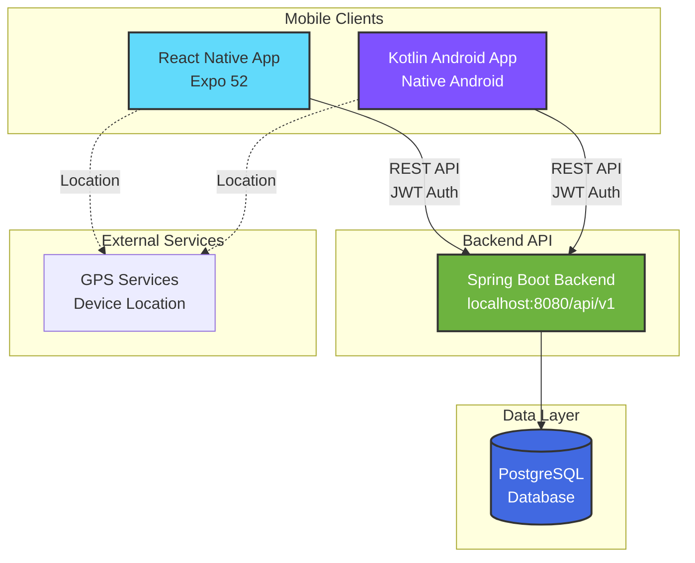

# Fast Eat - Architecture & API Specification

<div align="center">
  
</div>

---

Fast Eat is a food ordering platform with live drone delivery tracking. Originally developed as a university project with a professor-provided backend API, this repository documents the reimplementation of that closed API using enterprise-grade Spring Boot.

**Quick Navigation:** [Architecture & API Spec](https://github.com/gerolori/fast-eat-architecture) • [Spring Boot Backend](https://github.com/gerolori/fast-eat-backend-springboot) • [Kotlin Android App](https://github.com/gerolori/fast-eat-kotlin) • [React Native App](https://github.com/gerolori/fast-eat-react-native)

---


---

## Table of Contents

- [Table of Contents](#table-of-contents)
- [Introduction](#introduction)
  - [Background](#background)
  - [Purpose of This Repository](#purpose-of-this-repository)
- [Technology Stack](#technology-stack)
  - [Current Implementation](#current-implementation)
  - [Mobile Clients (Existing)](#mobile-clients-existing)
- [Architecture Overview](#architecture-overview)
- [Related Repositories](#related-repositories)
- [API Specification](#api-specification)
  - [Endpoints Overview](#endpoints-overview)
  - [Key Features](#key-features)
  - [Viewing the API Documentation](#viewing-the-api-documentation)
  - [Data Models](#data-models)
    - [User](#user)
    - [Menu](#menu)
    - [Ingredient](#ingredient)
    - [Order](#order)
    - [Order Status Flow](#order-status-flow)
  - [Validation Requirements](#validation-requirements)
    - [Field-Level Validation](#field-level-validation)
    - [Business Rule Validation](#business-rule-validation)
    - [Test Card Numbers](#test-card-numbers)
  - [Error Handling Standards](#error-handling-standards)
    - [Exception Types](#exception-types)
    - [Error Response Format](#error-response-format)
  - [Security Architecture](#security-architecture)
    - [Authentication Strategy](#authentication-strategy)
    - [Password Security](#password-security)
    - [Authorization](#authorization)
    - [CORS Configuration](#cors-configuration)
    - [Input Sanitization](#input-sanitization)
  - [Testing Requirements](#testing-requirements)
    - [Coverage Goals](#coverage-goals)
    - [Unit Testing Focus](#unit-testing-focus)
    - [Integration Testing Focus](#integration-testing-focus)
    - [Critical Test Scenarios](#critical-test-scenarios)
  - [Docker \& DevOps Best Practices](#docker--devops-best-practices)
    - [Multi-Stage Builds](#multi-stage-builds)
    - [Health Checks](#health-checks)
    - [Environment Configuration](#environment-configuration)
    - [Container Security](#container-security)
    - [Data Persistence](#data-persistence)
    - [Seed Data](#seed-data)
- [Future Backend Implementations](#future-backend-implementations)
  - [NestJS (TypeScript)](#nestjs-typescript)
  - [FastAPI (Python + MongoDB)](#fastapi-python--mongodb)
- [Design Language \& Consistency](#design-language--consistency)
  - [Visual Design Approach](#visual-design-approach)
    - [Color System (Centralized Variables)](#color-system-centralized-variables)
  - [Client-Specific Aesthetic Choices](#client-specific-aesthetic-choices)
  - [Backend Architectural Consistency](#backend-architectural-consistency)
- [License](#license)

---

## Introduction

This repository contains the architecture documentation and API specification for Fast Eat, a food ordering and delivery tracking mobile application ecosystem.

### Background

Fast Eat consists of two mobile applications developed as university projects for the Mobile Computing course (2024/25) at Università degli Studi di Milano:

- React Native implementation (Expo 52)
- Kotlin Android native implementation

During the course, a backend API was provided by the professor for examination purposes. However, this backend was closed after the exam period, making the mobile apps non-functional for demonstration or further development.

### Purpose of This Repository

This repository serves multiple purposes:

1. API Contract Preservation: Document and replicate the original API specification using modern OpenAPI 3.0.3 standards
2. Backend Implementation: Enable development of a replacement backend that the mobile apps can consume
3. Portfolio Showcase: Demonstrate enterprise-grade API design, backend development skills, and architectural thinking
4. Thesis Continuity: Apply similar architectural patterns and technologies from my thesis project (HRM "Airing" application) to showcase consistency in professional development practices

The backend implementation uses Spring Boot with patterns and practices mirroring my thesis work, showcasing:

- Multi-module Maven architecture
- Layered design (trigger/handler/repository pattern)
- JWT authentication & authorization
- Event-driven processing
- Docker containerization
- Production-ready error handling and validation

---

## Technology Stack

### Current Implementation

| Component           | Technology                  | Version |
| ------------------- | --------------------------- | ------- |
| Backend Framework   | Spring Boot                 | 3.2+    |
| Language            | Java                        | 17      |
| Database            | PostgreSQL                  | 15      |
| Authentication      | JWT (JSON Web Tokens)       | -       |
| API Documentation   | SpringDoc OpenAPI           | 3.2     |
| Containerization    | Docker + Docker Compose     | -       |
| Build Tool          | Maven (multi-module)        | -       |

### Mobile Clients (Existing)

| Platform            | Technology                  | Status      |
| ------------------- | --------------------------- | ----------- |
| Kotlin Android      | Native Android              |  Complete   |
| React Native        | Expo 52, React Native 0.76  |  Complete   |

---

## Architecture Overview



System Components:

- Mobile Apps: User-facing applications for food ordering and delivery tracking
- Spring Boot Backend: REST API implementing business logic, authentication, and data persistence
- PostgreSQL: Relational database for users, menus, ingredients, and orders
- GPS Services: Device location for menu filtering and delivery tracking

---

## Related Repositories

| Repository | Status | Description |
| --- | --- | --- |
| [fast-eat-backend-springboot](https://github.com/gerolori/fast-eat-backend-springboot) | In Development | Spring Boot backend implementation |
| [fast-eat-kotlin](https://github.com/gerolori/fast-eat-kotlin) | Complete | Kotlin Android mobile app |
| [fast-eat-react-native](https://github.com/gerolori/fast-eat-react-native) | Complete | React Native mobile app (Expo) |

See the [Spring Boot backend repository](https://github.com/gerolori/fast-eat-backend-springboot) for complete setup instructions and deployment guides.

---

## API Specification

The complete API contract is defined in OpenAPI 3.0.3 format:

 [api/openapi.yaml](api/openapi.yaml)

### Endpoints Overview

**Authentication** (3 endpoints)

- `POST /api/v1/auth/register` - User registration with profile and payment card
- `POST /api/v1/auth/login` - User authentication (returns JWT tokens)
- `POST /api/v1/auth/refresh` - Refresh access token

**Users** (2 endpoints)

- `GET /api/v1/users/me` - Get current user profile
- `PUT /api/v1/users/me` - Update user profile and payment information

**Menus** (4 endpoints)

- `GET /api/v1/menus?lat={lat}&lng={lng}` - List menus available at location
- `GET /api/v1/menus/{menuId}` - Get menu details
- `GET /api/v1/menus/{menuId}/ingredients` - Get ingredient list for menu
- `GET /api/v1/menus/{menuId}/image` - Get menu image (base64)

**Orders** (3 endpoints)

- `POST /api/v1/orders` - Create new order (requires complete profile)
- `GET /api/v1/orders/{orderId}` - Get order status with live tracking
- `GET /api/v1/orders/history` - Get user's completed orders

### Key Features

- JWT Authentication: 7-day access tokens, 30-day refresh tokens
- Location-Based: Menu filtering by GPS coordinates
- Live Tracking: Real-time drone position updates
- Validation: Comprehensive input validation (email, card numbers, etc.)
- Error Handling: Standardized error responses with detailed messages
- Business Rules: Single active order per user, payment validation

### Viewing the API Documentation

1. Copy the content of [api/openapi.yaml](api/openapi.yaml)
2. Paste into [Swagger Editor](https://editor.swagger.io)

### Data Models

This section describes the core entities in the Fast Eat system. All implementations must support these data structures.

#### User

Represents a registered user with profile and payment information.

**Fields:**

- `id` - Unique identifier (UUID or Long)
- `email` - User's email address (unique, validated)
- `password` - User's password (hashed, never exposed in responses)
- `firstName` - User's first name (max 15 characters, letters and spaces)
- `lastName` - User's last name (max 15 characters, letters and spaces)
- `cardFullName` - Full name as appears on credit card (max 31 characters)
- `cardNumber` - 16-digit credit card number
- `cardExpireMonth` - Card expiration month (1-12)
- `cardExpireYear` - Card expiration year (4 digits)
- `cardCVV` - 3-digit security code
- `createdAt` - Account creation timestamp
- `updatedAt` - Last update timestamp

#### Menu

Represents a food menu offered by a restaurant.

**Fields:**

- `id` - Unique identifier
- `name` - Menu name
- `shortDescription` - Brief description for list views
- `longDescription` - Detailed description for detail views
- `price` - Menu price (2 decimal places)
- `deliveryTime` - Estimated delivery time in minutes
- `imageUrl` - Reference to menu image
- `imageVersion` - Version number for cache invalidation
- `restaurantLocation` - Geographic coordinates of restaurant (latitude, longitude)
- `createdAt` - Creation timestamp
- `updatedAt` - Last update timestamp

#### Ingredient

Represents an ingredient in a menu.

**Fields:**

- `id` - Unique identifier
- `menuId` - Foreign key to Menu
- `name` - Ingredient name
- `description` - Ingredient description
- `origin` - Country or region of origin
- `bio` - Boolean indicating organic/biological status

#### Order

Represents a customer order with delivery tracking.

**Fields:**

- `id` - Unique identifier
- `userId` - Foreign key to User
- `menuId` - Foreign key to Menu
- `status` - Order status (see Order Status Flow below)
- `deliveryLocation` - Customer delivery coordinates (latitude, longitude)
- `currentPosition` - Live drone position (latitude, longitude)
- `expectedDeliveryTime` - Expected delivery timestamp
- `actualDeliveryTime` - Actual delivery timestamp (null until delivered)
- `createdAt` - Order placement timestamp
- `updatedAt` - Last update timestamp

#### Order Status Flow

Orders follow a defined state machine with the following valid transitions:

```
PENDING → CONFIRMED → PREPARING → READY → DELIVERING → DELIVERED
```

**Status Descriptions:**

- **PENDING** - Order created, awaiting restaurant confirmation
- **CONFIRMED** - Restaurant accepted, payment processed
- **PREPARING** - Food is being prepared
- **READY** - Ready for pickup by delivery drone
- **DELIVERING** - In transit to customer (currentPosition updates in real-time)
- **DELIVERED** - Successfully delivered to customer

**Business Rules:**

- Only forward transitions are allowed (cannot go from DELIVERED back to PENDING)
- Status updates trigger events for notifications
- The `currentPosition` field is only updated when status is DELIVERING

### Validation Requirements

All implementations must enforce the following validation rules:

#### Field-Level Validation

| Field                | Validation Rules                               |
| -------------------- | ---------------------------------------------- |
| **Email**                | Valid email format (RFC 5322 compliant)        |
| **Password**             | Minimum 8 characters                           |
| **First Name**           | Maximum 15 characters, letters and spaces only |
| **Last Name**            | Maximum 15 characters, letters and spaces only |
| **Card Full Name**       | Maximum 31 characters, letters and spaces only |
| **Card Number**          | Exactly 16 digits                              |
| **Card CVV**             | Exactly 3 digits                               |
| **Card Expiry Month**    | Integer between 1 and 12                       |
| **Card Expiry Year**     | 4-digit year, must be >= current year          |
| **Delivery Coordinates** | Latitude: -90 to 90, Longitude: -180 to 180    |

#### Business Rule Validation

- **Unique Email:** No two users can have the same email address
- **Complete Profile:** Users must complete all profile fields before placing an order
- **Single Active Order:** Users can only have one active order at a time (status not DELIVERED)
- **Menu Availability:** Menu must exist and be available at the delivery location
- **Valid Payment Card:** Card expiration date must be in the future

#### Test Card Numbers

For testing purposes, any card number starting with the digit `1` is considered valid by the system.

### Error Handling Standards

All implementations must return standardized error responses.

#### Exception Types

| Exception            | HTTP Status | Description                                                                       |
| -------------------- | ----------- | --------------------------------------------------------------------------------- |
| **NotFoundError**        | 404         | Requested resource does not exist                                                 |
| **ValidationError**      | 400         | Input validation failed                                                           |
| **ConflictError**        | 409         | Request conflicts with current state (e.g., duplicate email, active order exists) |
| **PaymentRequiredError** | 402         | Payment validation failed                                                         |
| **UnauthorizedError**    | 401         | Authentication required or failed                                                 |
| **ForbiddenError**       | 403         | User lacks permission to access resource                                          |

#### Error Response Format

All error responses must follow this JSON structure:

```json
{
  "status": 400,
  "message": "Validation failed",
  "timestamp": "2026-02-23T10:30:00Z",
  "path": "/api/v1/orders",
  "errors": [
    {
      "field": "cardNumber",
      "message": "Card number must be exactly 16 digits"
    }
  ]
}
```

**Required Fields:**

- `status` - HTTP status code
- `message` - Human-readable error summary
- `timestamp` - ISO 8601 formatted timestamp
- `path` - API endpoint that generated the error
- `errors` - Array of field-level errors (optional, for validation errors)

**Field Error Object:**

- `field` - Name of the field that failed validation
- `message` - Specific error message for this field

### Security Architecture

#### Authentication Strategy

Fast Eat uses JWT (JSON Web Token) based authentication for stateless, scalable authentication.

**Token Types:**

- **Access Token** - 7-day expiration, included in Authorization header for API requests
- **Refresh Token** - 30-day expiration, used to obtain new access tokens

**Authentication Flow:**

1. User registers or logs in
2. Server returns access token and refresh token
3. Client includes access token in `Authorization: Bearer {token}` header
4. When access token expires, client uses refresh token to obtain new tokens

#### Password Security

- Passwords must be hashed using BCrypt algorithm
- Passwords must never be returned in API responses
- Minimum password length: 8 characters
- Password strength validation recommended but not required

#### Authorization

**Role-Based Access Control (RBAC):**

- **Customer** - Standard user role, can browse menus and place orders
- **Admin** - Administrative role (future use for restaurant management)

**Protected Endpoints:**

- All endpoints except `/auth/register`, `/auth/login`, and `/auth/refresh` require authentication
- Some endpoints may require specific roles (e.g., admin endpoints)

#### CORS Configuration

- Implementations should whitelist allowed origins (mobile client URLs)
- Support for credentials should be enabled for cookie-based features (if any)
- Configuration should be environment-specific (development vs. production)

#### Input Sanitization

All implementations must sanitize input to prevent:

- SQL injection attacks
- NoSQL injection attacks
- Cross-site scripting (XSS)
- Command injection

### Testing Requirements

All implementations must meet the following testing standards.

#### Coverage Goals

| Layer              | Minimum Coverage | Critical Paths                          |
| ------------------ | ---------------- | --------------------------------------- |
| **Overall**            | 70%              | -                                       |
| **Authentication**     | 100%             | User registration, login, token refresh |
| **Order Processing**   | 100%             | Order creation, status transitions      |
| **Payment Validation** | 100%             | Card validation, business rules         |
| **API Endpoints**      | 80%              | All controller/route handlers           |
| **Business Logic**     | 85%              | All service layer logic                 |

#### Unit Testing Focus

Unit tests should cover:

- Business logic validation
- Card number format validation
- Email format validation
- Order status state machine transitions
- JWT token generation and validation
- Utility functions and helpers

#### Integration Testing Focus

Integration tests should cover:

- Complete API endpoint request/response cycles
- Database operations (create, read, update, delete)
- Authentication flows (register → login → refresh)
- Complete order placement workflow
- Error handling and edge cases
- Database transaction rollback scenarios

#### Critical Test Scenarios

The following scenarios must have 100% test coverage:

1. **User Registration with Invalid Data**
   - Invalid email format
   - Duplicate email
   - Invalid card number format
   - Card expiration in the past

2. **Order Placement Business Rules**
   - Incomplete user profile
   - Active order already exists
   - Invalid menu ID
   - Invalid delivery coordinates

3. **Authentication Edge Cases**
   - Expired access token
   - Invalid refresh token
   - Malformed JWT token
   - Missing Authorization header

### Docker & DevOps Best Practices

All backend implementations should follow these containerization practices.

#### Multi-Stage Builds

Use multi-stage Docker builds to minimize final image size:

**Benefits:**

- 60-70% smaller final image size compared to single-stage builds
- Only runtime dependencies included in final image
- Faster deployment and reduced attack surface
- Efficient layer caching for faster rebuilds

**Pattern:**

1. **Build Stage** - Install build tools, compile/build application
2. **Runtime Stage** - Copy only compiled artifacts and runtime dependencies

#### Health Checks

Implement health check endpoints for container orchestration:

**Health Check Pattern:**

- Endpoint: `GET /api/v1/health` or `/health`
- Response: `200 OK` with optional health status details
- Should verify database connectivity
- Should verify critical dependencies (Redis, external APIs, etc.)

**Docker Health Check Configuration:**

- Interval: 30 seconds
- Timeout: 10 seconds
- Retries: 3
- Start period: 40 seconds (allows application startup time)

#### Environment Configuration

Use environment-based configuration profiles:

| Profile    | Purpose               | Database                   | Use Case           |
| ---------- | --------------------- | -------------------------- | ------------------ |
| **local**      | Local development     | Local database instance    | IDE debugging      |
| **docker**     | Container development | Containerized database     | Full stack testing |
| **test**       | Test environment      | In-memory or test database | CI/CD pipelines    |
| **production** | Production deployment | Cloud-managed database     | Live deployment    |

#### Container Security

- Run containers as non-root user
- Use minimal base images (alpine variants)
- Scan images for vulnerabilities
- Keep base images updated
- Never include secrets in images (use environment variables)

#### Data Persistence

- Use named volumes for database data persistence
- Separate volumes for different services (database, redis, etc.)
- Configure volume drivers appropriate for environment
- Implement backup strategies for production data

#### Seed Data

**Development/Showcase Environment:**

- Pre-populate with realistic test data
- Include sample restaurants (5-10) with Milan-area locations
- Include diverse menus (20+) with ingredients
- Include test user accounts
- Use realistic coordinates (Milan: 45.4642° N, 9.1900° E region)

**Production Environment:**

- Empty database on initialization
- All data populated via API only
- Migration scripts for schema only

---

## Future Backend Implementations

While the current implementation focuses on Spring Boot, I would like to explore other languages/stacks to implement the same API specs:

### NestJS (TypeScript)

- Full-stack TypeScript with shared type definitions
- Angular-like dependency injection and module system
- Modern Node.js enterprise patterns
- Performance comparison: JVM vs V8

### FastAPI (Python + MongoDB)

- Rapid development with automatic OpenAPI generation
- Async/await patterns for high-performance APIs
- NoSQL document modeling (contrast to PostgreSQL)
- Development velocity comparison across Java, TypeScript, Python

Both would implement the same OpenAPI specification, ensuring API consistency and enabling architectural comparison.

---

## Design Language & Consistency

The Fast Eat ecosystem maintains visual and architectural consistency through centralized design tokens and shared aesthetic principles.

### Visual Design Approach

Both mobile applications follow a Material Design 3 aesthetic with a custom teal color palette inspired by modern food delivery apps.

#### Color System (Centralized Variables)

**React Native** (`styles/styles.js`)

```javascript
colors: {
  main: '#1ab2b2',        // Primary teal - buttons, active states, brand elements
  mainMid: '#10827c',     // Medium teal - hover states, secondary accents
  mainDark: '#0a5c53',    // Dark teal - text on light backgrounds, depth
  background: '#FFFFFF',
  surface: '#F8F8F8',
  textPrimary: '#333333',
  textSecondary: '#666666'
}
```

**Kotlin Android** (`ui/theme/Color.kt`)

```kotlin
val Main = Color(0xFF1AB2B2)
val MainMid = Color(0xFF10827C)
val MainDark = Color(0xFF0A5C53)
// Material3 theming system adapts these colors to light/dark modes
```

**Design Tokens:** All color values, spacing units (8dp grid), typography scales, and component dimensions are defined in centralized style files, ensuring consistency across screens and making theme updates trivial.

### Client-Specific Aesthetic Choices

While both mobile clients share the same teal color palette and Material Design 3 foundation, each platform implements these principles through its native ecosystem with subtle differences in execution. The React Native implementation biluds a custom component library with card-based layouts featuring 8dp rounded corners, a bottom tab bar with teal icon tinting, and rounded pill-shaped buttons (borderRadius: 25), relying on system fonts that adapt between San Francisco on iOS and Roboto on Android. The Kotlin Android application embraces Jetpack Compose and the complete Material Design 3 component system more directly, using composable Surface cards with Material3's elevation system, NavigationBar components with vector drawable icons and ripple effects, and the full Material3 typography scale (headlineLarge, bodyMedium, labelSmall). Despite these platform-specific implementations, both applications converge on shared UI principles: an 8dp spacing grid with 16dp horizontal padding standards, card-based content grouping with consistent corner radii, location-aware menu cards with horizontal layouts (image left, text center, price right), bottom action bars for primary interactions, and real-time status updates with visual loading indicators.

### Backend Architectural Consistency

The Spring Boot backend follows the same patterns established in my thesis project:

- Multi-module structure (apps, commons, components, shared modules)
- Layered architecture (trigger layer for controllers, handler layer for services, repository layer for data access)
- Custom security annotations for role-based authorization (@Customer, @Admin)
- Record-based DTOs with nested structures for clean API contracts
- Profile-based configuration management (local, docker, production environments)

This consistency demonstrates professional development practices carried across multiple projects.

---

## License

This project is for educational and portfolio purposes.

**Important Notes:**

- All data (menus, restaurants, user information, payment cards) is fictional
- No real payment processing is implemented (simulated validation only)
- Original course API design by the professor; implementation is independent
