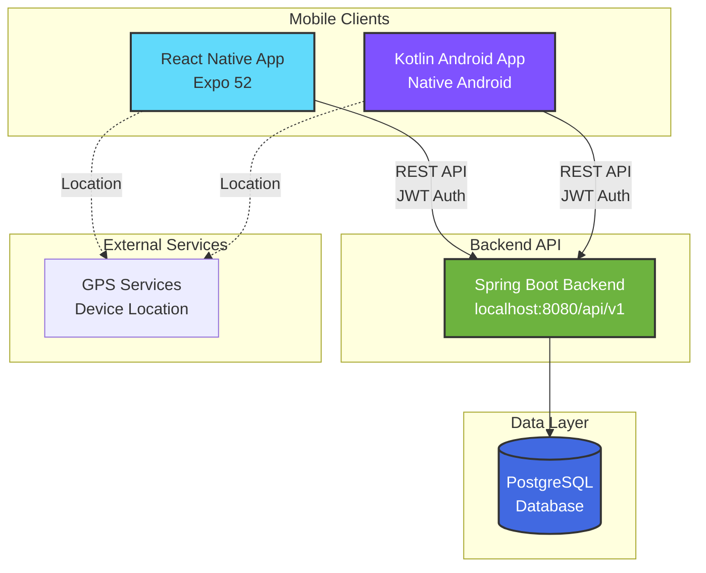

<div align="center">
  
  <h1>Fast Eat</h1>
  <p><i>Architecture & API Specification</i></p>
</div>

---

Fast Eat is a food ordering platform with live drone delivery tracking. Originally developed as a university project with a professor-provided backend API, this repository documents the reimplementation of that closed API using enterprise-grade Spring Boot.

**Quick Navigation:** [Spring Boot Backend](https://github.com/gerolori/fast-eat-backend-springboot) • [React Native App](https://github.com/gerolori/fast-eat-react-native) • [Kotlin Android App](https://github.com/gerolori/fast-eat-kotlin) • [Architecture](https://github.com/gerolori/fast-eat-architecture) • [API Spec](api/openapi.yaml)

---

### Apps Showcase

WIP

<!-- <table>
  <tr>
    <td align="center">
      <br/>
      <sub>Menu Browsing</sub>
    </td>
    <td align="center">
      <br/>
      <sub>Menu Details</sub>
    </td>
    <td align="center">
      <br/>
      <sub>Live Tracking</sub>
    </td>
  </tr>
  <tr>
    <td align="center">
      <br/>
      <sub>User Profile</sub>
    </td>
    <td align="center">
      <br/>
      <sub>Onboarding</sub>
    </td>
    <td align="center">
      <br/>
      <sub>Swagger Docs</sub>
    </td>
  </tr>
</table> -->

---


---

## Table of Contents

- [Table of Contents](#table-of-contents)
- [Introduction](#introduction)
  - [Background](#background)
  - [Purpose of This Repository](#purpose-of-this-repository)
- [Technology Stack](#technology-stack)
  - [Current Implementation](#current-implementation)
  - [Mobile Clients (Existing)](#mobile-clients-existing)
- [Architecture Overview](#architecture-overview)
- [Related Repositories](#related-repositories)
- [API Specification](#api-specification)
  - [Endpoints Overview](#endpoints-overview)
  - [Key Features](#key-features)
  - [Viewing the API Documentation](#viewing-the-api-documentation)
- [Connection to Thesis Work](#connection-to-thesis-work)
  - [Shared Architectural Patterns](#shared-architectural-patterns)
  - [Technology Continuity](#technology-continuity)
- [Future Backend Implementations](#future-backend-implementations)
  - [NestJS (TypeScript)](#nestjs-typescript)
  - [FastAPI (Python + MongoDB)](#fastapi-python--mongodb)
- [Design Language \& Consistency](#design-language--consistency)
  - [Visual Design Approach](#visual-design-approach)
    - [Color System (Centralized Variables)](#color-system-centralized-variables)
  - [Client-Specific Aesthetic Choices](#client-specific-aesthetic-choices)
  - [Backend Architectural Consistency](#backend-architectural-consistency)
- [License](#license)

---

## Introduction

This repository contains the architecture documentation and API specification for Fast Eat, a food ordering and delivery tracking mobile application ecosystem.

### Background

Fast Eat consists of two mobile applications developed as university projects for the Mobile Computing course (2024/25) at Università degli Studi di Milano:

- React Native implementation (Expo 52)
- Kotlin Android native implementation

During the course, a backend API was provided by the professor for examination purposes. However, this backend was closed after the exam period, making the mobile apps non-functional for demonstration or further development.

### Purpose of This Repository

This repository serves multiple purposes:

1. API Contract Preservation: Document and replicate the original API specification using modern OpenAPI 3.0.3 standards
2. Backend Implementation: Enable development of a replacement backend that the mobile apps can consume
3. Portfolio Showcase: Demonstrate enterprise-grade API design, backend development skills, and architectural thinking
4. Thesis Continuity: Apply similar architectural patterns and technologies from my thesis project (HRM "Airing" application) to showcase consistency in professional development practices

The backend implementation uses Spring Boot with patterns and practices mirroring my thesis work, showcasing:

- Multi-module Maven architecture
- Layered design (trigger/handler/repository pattern)
- JWT authentication & authorization
- Event-driven processing
- Docker containerization
- Production-ready error handling and validation

---

## Technology Stack

### Current Implementation

| Component           | Technology                  | Version |
| ------------------- | --------------------------- | ------- |
| Backend Framework   | Spring Boot                 | 3.2+    |
| Language            | Java                        | 17      |
| Database            | PostgreSQL                  | 15      |
| Authentication      | JWT (JSON Web Tokens)       | -       |
| API Documentation   | SpringDoc OpenAPI           | 3.2     |
| Containerization    | Docker + Docker Compose     | -       |
| Build Tool          | Maven (multi-module)        | -       |

### Mobile Clients (Existing)

| Platform            | Technology                  | Status      |
| ------------------- | --------------------------- | ----------- |
| Kotlin Android      | Native Android              |  Complete   |
| React Native        | Expo 52, React Native 0.76  |  Complete   |

---

## Architecture Overview



System Components:

- Mobile Apps: User-facing applications for food ordering and delivery tracking
- Spring Boot Backend: REST API implementing business logic, authentication, and data persistence
- PostgreSQL: Relational database for users, menus, ingredients, and orders
- GPS Services: Device location for menu filtering and delivery tracking

---

## Related Repositories

| Repository | Status | Description |
| --- | --- | --- |
| [fast-eat-backend-springboot](https://github.com/gerolori/fast-eat-backend-springboot) | In Development | Spring Boot backend implementation |
| [fast-eat-kotlin](https://github.com/gerolori/fast-eat-kotlin) | Complete | Kotlin Android mobile app |
| [fast-eat-react-native](https://github.com/gerolori/fast-eat-react-native) | Complete | React Native mobile app (Expo) |

See the [Spring Boot backend repository](https://github.com/gerolori/fast-eat-backend-springboot) for complete setup instructions and deployment guides.

---

## API Specification

The complete API contract is defined in OpenAPI 3.0.3 format:

 [api/openapi.yaml](api/openapi.yaml)

### Endpoints Overview

**Authentication** (3 endpoints)

- `POST /api/v1/auth/register` - User registration with profile and payment card
- `POST /api/v1/auth/login` - User authentication (returns JWT tokens)
- `POST /api/v1/auth/refresh` - Refresh access token

**Users** (2 endpoints)

- `GET /api/v1/users/me` - Get current user profile
- `PUT /api/v1/users/me` - Update user profile and payment information

**Menus** (4 endpoints)

- `GET /api/v1/menus?lat={lat}&lng={lng}` - List menus available at location
- `GET /api/v1/menus/{menuId}` - Get menu details
- `GET /api/v1/menus/{menuId}/ingredients` - Get ingredient list for menu
- `GET /api/v1/menus/{menuId}/image` - Get menu image (base64)

**Orders** (3 endpoints)

- `POST /api/v1/orders` - Create new order (requires complete profile)
- `GET /api/v1/orders/{orderId}` - Get order status with live tracking
- `GET /api/v1/orders/history` - Get user's completed orders

### Key Features

- JWT Authentication: 7-day access tokens, 30-day refresh tokens
- Location-Based: Menu filtering by GPS coordinates
- Live Tracking: Real-time drone position updates
- Validation: Comprehensive input validation (email, card numbers, etc.)
- Error Handling: Standardized error responses with detailed messages
- Business Rules: Single active order per user, payment validation

### Viewing the API Documentation

1. Copy the content of [api/openapi.yaml](api/openapi.yaml)
2. Paste into [Swagger Editor](https://editor.swagger.io)

---

## Connection to Thesis Work

This project applies patterns and technologies from my thesis project, a Human Resources Management system built with Spring Boot for enterprise HR workflows.

### Shared Architectural Patterns

| Pattern                            | Thesis                        | This Project (Fast Eat)       |
| ---------------------------------- | ----------------------------- | ----------------------------- |
| Architecture Style                 | Multi-module Maven monolith   | Multi-module Maven monolith   |
| Layer Organization                 | trigger/handler/repository    | trigger/handler/repository    |
| Domain Design                      | Contact, Employee, Application| User, Menu, Order             |
| Security                           | Custom @Admin, @HR annotations| Custom @Customer, @Admin      |
| Event Processing                   | ApplicationEventPublisher     | ApplicationEventPublisher     |
| DTO Pattern                        | Java Records (nested)         | Java Records (nested)         |
| Error Handling                     | @ControllerAdvice centralized | @ControllerAdvice centralized |
| Async Operations                   | @Scheduled cron tasks         | @Scheduled status updates     |
| Docker Strategy                    | Multi-stage builds            | Multi-stage builds            |
| Configuration Management           | Profile-based (local/docker)  | Profile-based (local/docker)  |

### Technology Continuity

- Spring Boot 3.2+ with Java 17 (LTS)
- Spring Data JPA with PostgreSQL (relational data modeling)
- Spring Security with JWT authentication
- SpringDoc OpenAPI for automatic API documentation
- Docker containerization with health checks
- JUnit 5 + Mockito for testing

---

## Future Backend Implementations

While the current implementation focuses on Spring Boot, I would like to explore other languages/stacks to implement the same API specs:

### NestJS (TypeScript)

- Full-stack TypeScript with shared type definitions
- Angular-like dependency injection and module system
- Modern Node.js enterprise patterns
- Performance comparison: JVM vs V8

### FastAPI (Python + MongoDB)

- Rapid development with automatic OpenAPI generation
- Async/await patterns for high-performance APIs
- NoSQL document modeling (contrast to PostgreSQL)
- Development velocity comparison across Java, TypeScript, Python

Both would implement the same OpenAPI specification, ensuring API consistency and enabling architectural comparison.

---

## Design Language & Consistency

The Fast Eat ecosystem maintains visual and architectural consistency through centralized design tokens and shared aesthetic principles.

### Visual Design Approach

Both mobile applications follow a Material Design 3 aesthetic with a custom teal color palette inspired by modern food delivery apps.

#### Color System (Centralized Variables)

**React Native** (`styles/styles.js`)

```javascript
colors: {
  main: '#1ab2b2',        // Primary teal - buttons, active states, brand elements
  mainMid: '#10827c',     // Medium teal - hover states, secondary accents
  mainDark: '#0a5c53',    // Dark teal - text on light backgrounds, depth
  background: '#FFFFFF',
  surface: '#F8F8F8',
  textPrimary: '#333333',
  textSecondary: '#666666'
}
```

**Kotlin Android** (`ui/theme/Color.kt`)

```kotlin
val Main = Color(0xFF1AB2B2)
val MainMid = Color(0xFF10827C)
val MainDark = Color(0xFF0A5C53)
// Material3 theming system adapts these colors to light/dark modes
```

**Design Tokens:** All color values, spacing units (8dp grid), typography scales, and component dimensions are defined in centralized style files, ensuring consistency across screens and making theme updates trivial.

### Client-Specific Aesthetic Choices

While both mobile clients share the same teal color palette and Material Design 3 foundation, each platform implements these principles through its native ecosystem with subtle differences in execution. The React Native implementation biluds a custom component library with card-based layouts featuring 8dp rounded corners, a bottom tab bar with teal icon tinting, and rounded pill-shaped buttons (borderRadius: 25), relying on system fonts that adapt between San Francisco on iOS and Roboto on Android. The Kotlin Android application embraces Jetpack Compose and the complete Material Design 3 component system more directly, using composable Surface cards with Material3's elevation system, NavigationBar components with vector drawable icons and ripple effects, and the full Material3 typography scale (headlineLarge, bodyMedium, labelSmall). Despite these platform-specific implementations, both applications converge on shared UI principles: an 8dp spacing grid with 16dp horizontal padding standards, card-based content grouping with consistent corner radii, location-aware menu cards with horizontal layouts (image left, text center, price right), bottom action bars for primary interactions, and real-time status updates with visual loading indicators.

### Backend Architectural Consistency

The Spring Boot backend follows the same patterns established in my thesis project:

- Multi-module structure (apps, commons, components, shared modules)
- Layered architecture (trigger layer for controllers, handler layer for services, repository layer for data access)
- Custom security annotations for role-based authorization (@Customer, @Admin)
- Record-based DTOs with nested structures for clean API contracts
- Profile-based configuration management (local, docker, production environments)

This consistency demonstrates professional development practices carried across multiple projects.

---

## License

This project is for educational and portfolio purposes.

**Important Notes:**

- All data (menus, restaurants, user information, payment cards) is fictional
- No real payment processing is implemented (simulated validation only)
- Original course API design by the professor; implementation is independent
